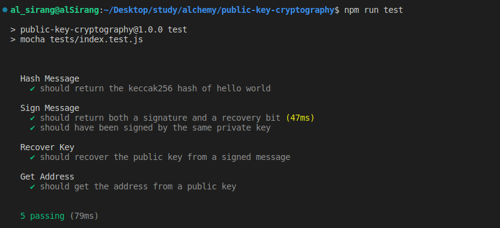

# Public Key Cryptography

Public Key Cryptography with ECDSA (Elliptic Curve Digital Signature Algorithm)

## Goal

Recover the public key from the signature and transform the public key into the user's ethereum address.

## Available Scripts

- Type `npm install` to install required packages
- Type `npm run test` to run tests

## Test Results

